# PROCEDURE
**STEP 1**:-
## First of all open a index.html
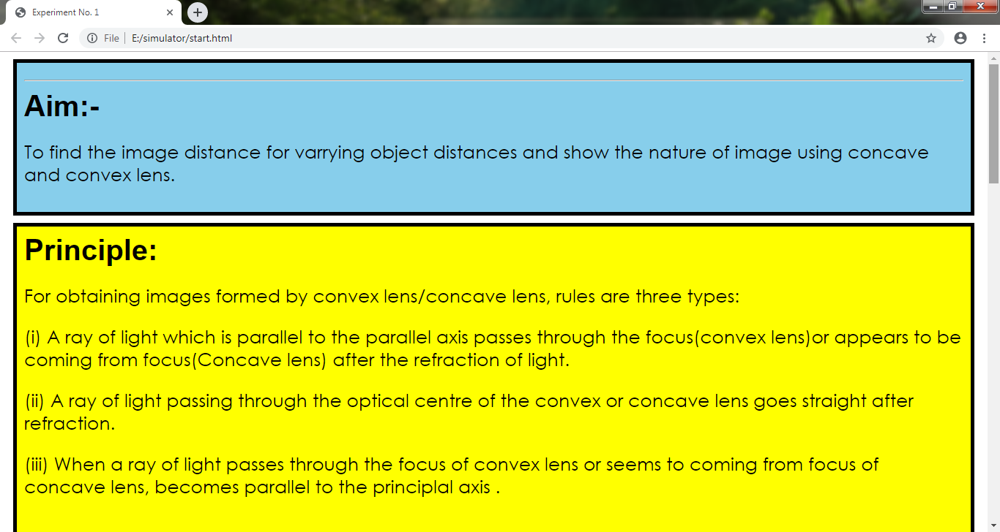

**STEP 2** : 
## At the end of webpage there is button who redirect to the prequestion.html
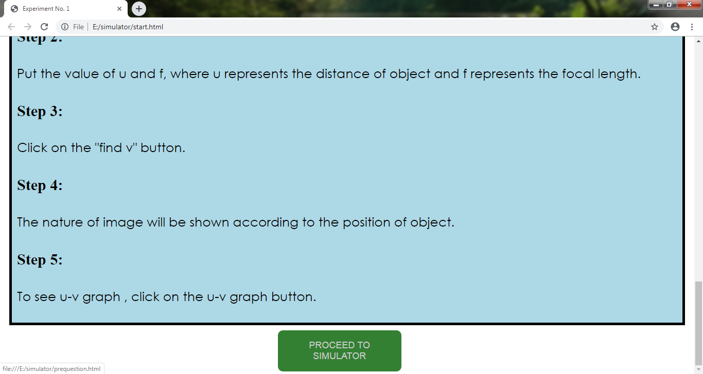

**STEP 3** : - 
## Now you  come to the prequestion 
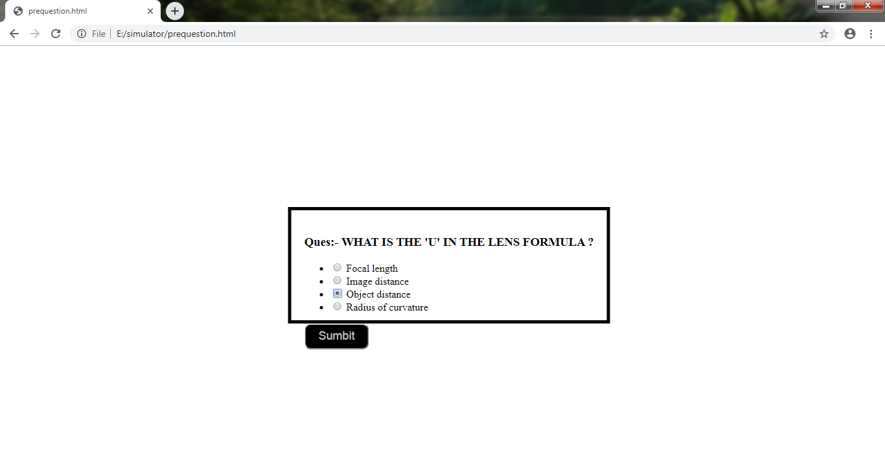

**STEP 3 a.** :  
## If you give the wrong answer you go to the start.html and read theory once again

**STEP 3 b**:- 
## If you give the right answer it direct to the simulator.html
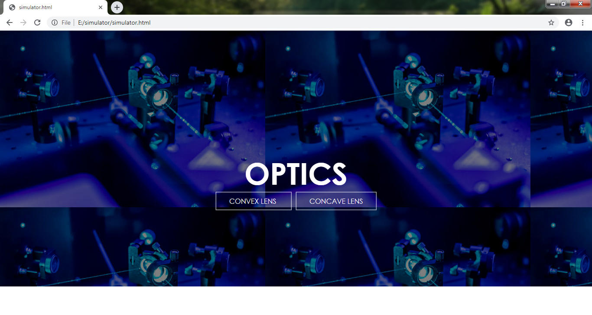

**STEP 4** :- 
## Now select the lens CONCAVE OR CONVEX

**STEP 4a** :-

(i)
## If you select the convex lens
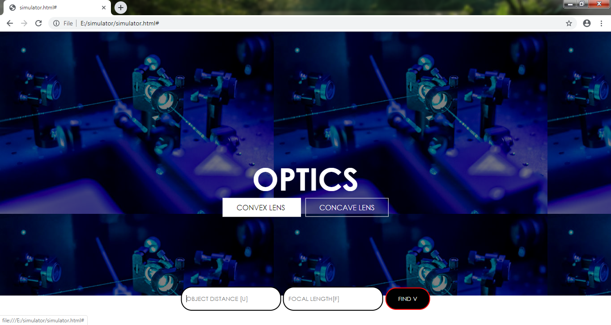

(ii)
## Now enter the object distance and focal length click the button 'FIND V'
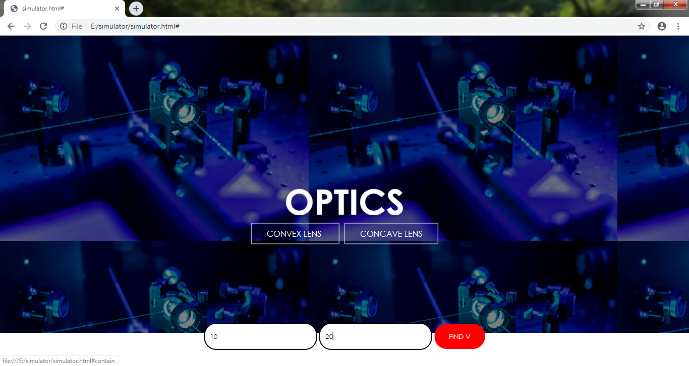

(iii)
## You find the image distance and particular case of image(images are constant they only give the idea about where the image placed )
## Now click 'DRAW U Vs V graph'
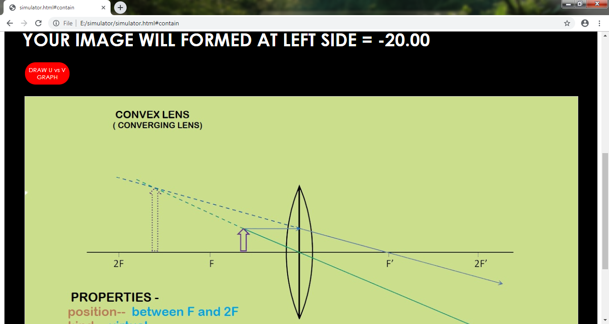

(iv)
##Now the graph will show of convex lens 
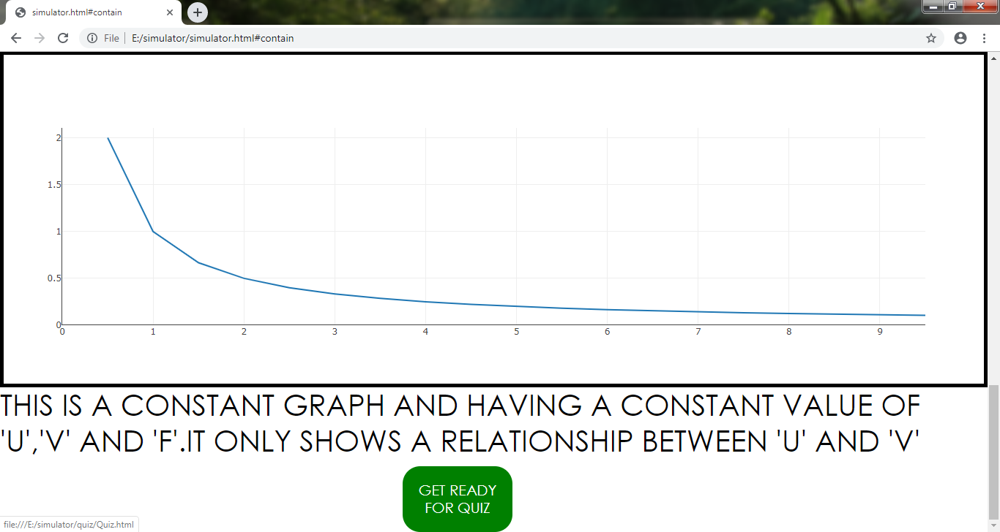

**STEP 4b** :-

(i)
## If you select the concave lens
## Now enter the object distance and focal length click the button 'FIND V'
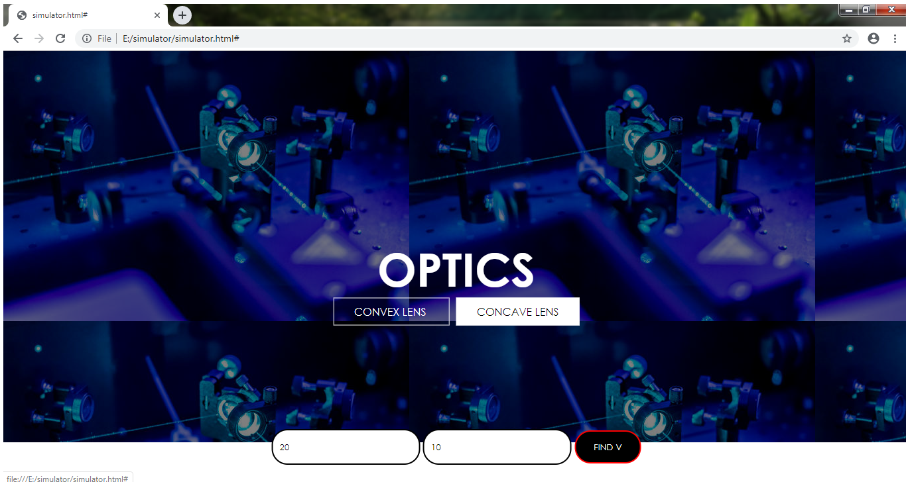

(ii)
## You find the image distance and particular case of image(images are constant they only give the idea about where the image placed )
## Now click 'DRAW U Vs V graph'
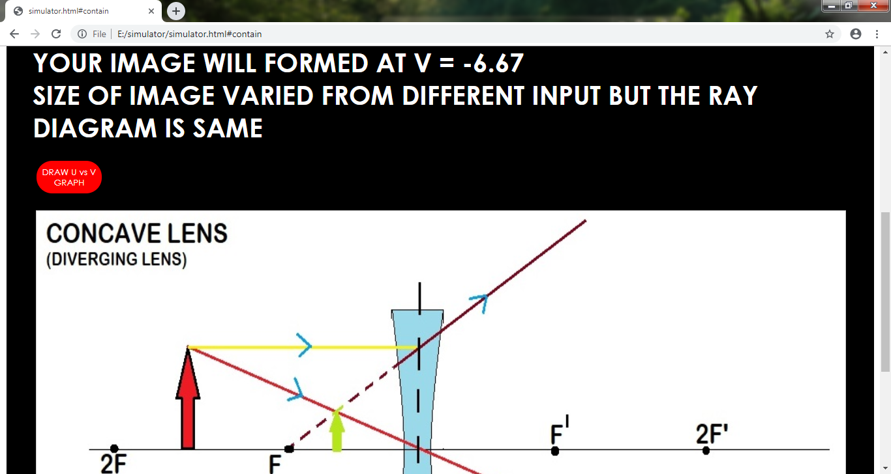

(iii)
##Now the graph will show of concave lens 
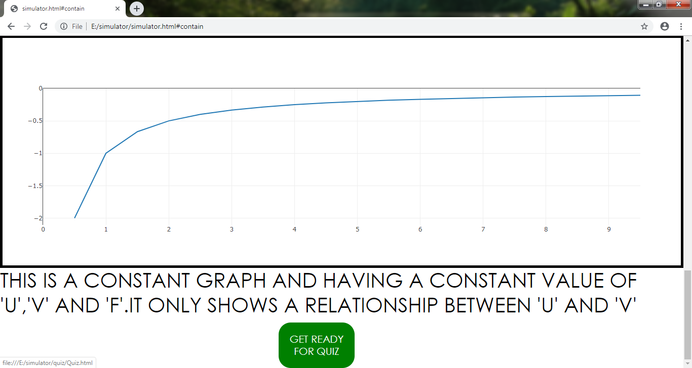

**STEP 5**:-
## Now click on the button 'READY FOR QUIZ'

**STEP 6**:-
## Now attempt the quiz of 10 question every question is 10 marks
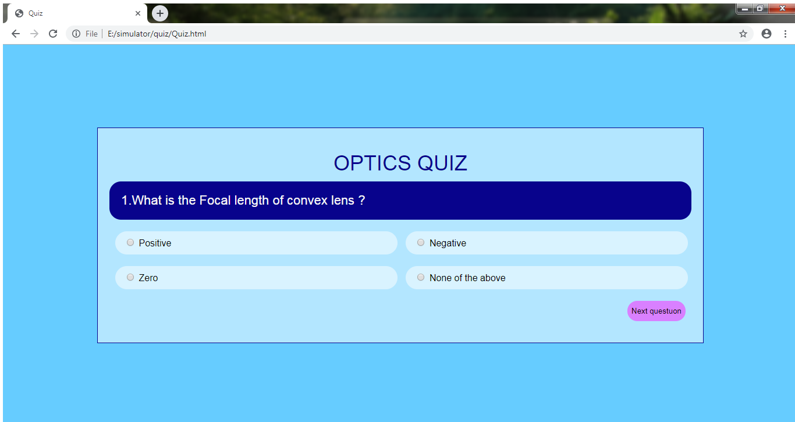

**STEP 7** :- 
## At the end it will show result of your quiz
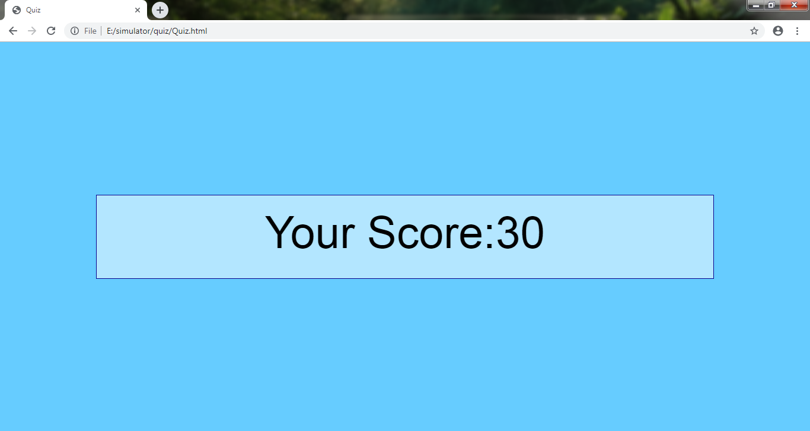

# EXPERIMENT COMPLETED
