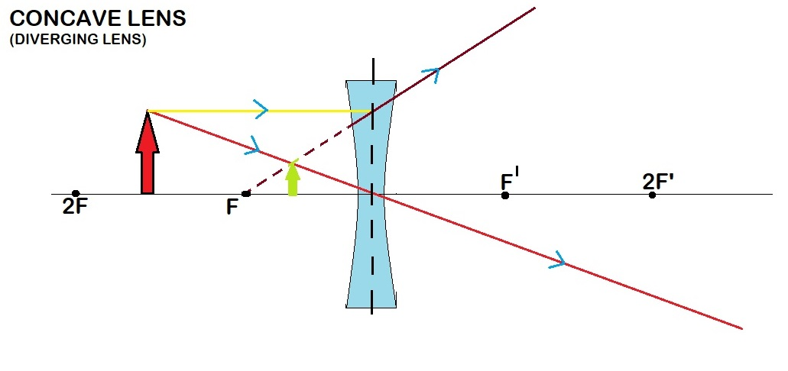

# 1.1 FOCUS AREA:

#### Optics 

# 1.2 About the Experiment:
Lens can diverge and converge the ray of light. Whenever a ray of light fall on lens it’s  formed  real and virtual image. by the lens formula we can find the image distance.
### Lens formula –(1/u)+(1/v)=(1/f)
**u= object distance**

**v=image distance**

**f=focal length**

### According image distance and focal length of lens find distance and nature of image .
#### For the convex lens nature of image **:-**
1. At infinity

2. Beyond 2F

3. At 2F
 
4. Between F and 2F

5. At the focus F

6. Between the focus F and optical centre C

#### For the concave lens nature of image –

1. At infinity

2. Between infinity and optical centre

## 1.3 Learning Objectives: 
|S.No.|	Learning Objective|	Cognitive Level |	Action Verb|
|-----|-------------------|-----------------|------------|
|1|	Identify the relation between  the object distance image distance and  focal length  of  lens.|	Understand |	Describe|
|2| Describe the methodology to vary object distance and observe the image distance and nature of image.|	Understand|	Examine|
|3|	Predict the variation of image distance according to object distance.|	Apply |	Predict|
|4|	Conclude about the image like that image distance  nature of image and relation between u and v|	Evaluate|	Conclude|

#### 2. Instructional Strategy:

#### 2.1 Instructional Strategy:
**1**:- YOU HAVE TO FOLLOW THE PROCEDURE.

**2**:- NOT INPUT THE NEGATIVE VALUE TO THE SIMULATOR.

**3**:- IN CASE OF CONCAVE LENS IT AUTOMATIC TAKES A NEGATIVE FOCAL LENGTH.

**4**:- FOLLOW  THE STEP IN LINEAR MANNER(Don't jump any step of the procedure). 

#### 2.2 Assessment Method:

#### Quiz will be taken for evaluation (Example given below)

## Pre test
1.What is the ‘U’ in the lens formula ?

a) **object distance**

b) Image distance

c) Focal length

d) Radius of curavature

## Post test
Question 1:-**What is the Focal length of convex lens ?**

option1: **Positive**

option2:-Negative

option3:-Zero

option4:-None of the above.

Question 2:-**What is the Focal length of concave lens ?**

option1: Positive

option2:**Negative**

option3:Zero

option4:None of the above.

Question 3:**What is the Nature of concave lens ?**

option1: Converging

option2:**Diverging**

option3:Don't know

option4:-None of the above.

Question 4:**What is the Nature of convex lens ?**

option1: **Converging**

option2:Diverging.

option3:Don't know

option4:-None of the above

Question 5:**What is 'F' stand in lens formula ?**
	
  option1: Image distance
	
  option2: Object distance
	
  option3: **Focal length**
	
  option4: Radius of curvature
  
Question 6 :**What is 'V' stand in lens formula ?**
	
  option1: **Image distance**
	
  option2: Object distance
	
  option3: Focal length
	
  option4: Radius of curvature
  
Question 7 :**What is 'U' stand in lens formula ?**
	
  option1: Image distance
	
  option2: **Object distance**
	
  option3: Focal length
	
  option4: Radius of curvature

 Question 8 :**What is 'R' stand in lens formula ?**
	
  option1: Image distance
	
  option2: Object distance
	
  option3: Focal length
	
  option4:**Radius of curvature**
	
Question 9 :**What is the condition   image formed at infinity in convex lens?**
	
  option1: U=R
	
  option2: U=V
	
  option3:**U=F**
  
  option4: U=0

Question 10 :**What is the condition  virtual image formed in  convex lens?**

  option1: U>R
  
  option2: F<U<R
	
  option3:**U<F**
	
  option4: None of the above

## 2.3 Description of sections:
In order to find the the image distance for varrying object distance and show the nature of image  using concave and convex lens.

First of all we know two factor:

1.image distance

2.focal length of lens

Using the lens famula  find the image distance
**(1/u)+(1/v)=(1/f)**

#### u=object distance
#### v=image distance
#### f=focal length
### one example of  image formation:

 
## Result:
**1**. Give the image distance
**2**. Nature of image formation
**3**. Graph of ‘u’ and ‘v’
#### CALCULATION:

Calculate the image distance by object distance in the graph

## 3. Task & Assessment Questions
|SrNo.|	Learning Objective to be met |Tasks to be performed by the students|Assessment questions aligned to the task|
|-----|------------------------------|-------------------------------------|-----------------------------------------|
|1|Recall the concept of image formation by lens|Student take  one by one different value and analyse nature of image|1. In which condition the convex lens formed image at infinite ? a) U=R  b)U=V  c)U=F  d)U=0|
|2|Student can Predict the variation of image distance according to object distance|Student select the value of u and f .|Accordingly this image distance change1.What is nature of convex lens ? a)converging  b)diverging c)don’t know d)none of these|
|3|Describe the methodology to vary object distance and observe the image distance in lens|Student select the graph button and read the graph clearly.|	
|4|Conclude about the image like that image distance  nature of image and relation between u and v|Student perform the experiment on simulator.|What is the condition virtual image in convex lens ?a)U>R b)F<U<R  c)U<F  d)none of  these|

## 4. Simulator Interactions

|What students will do?|What simulator will do?|Purpose of the task|
|----------------------|-----------------------|-------------------|
|Student will select the button for lens .|Simulator select type of lens  that use for experiment .|Purpose that take  input of image distance and focal length of lens and also initiate the simulator.|
|Student input the value of ‘u’ and ‘f’ and select the ‘v’ button.|Simulator find the image distance and behavior of image with respect to object.|To check the behavior of  image .|
|Student will press the u and v graph button|Simulator show the u and v graph.But it’ a constant graph|Show by  graph  image distance  with respect to object distance.|
