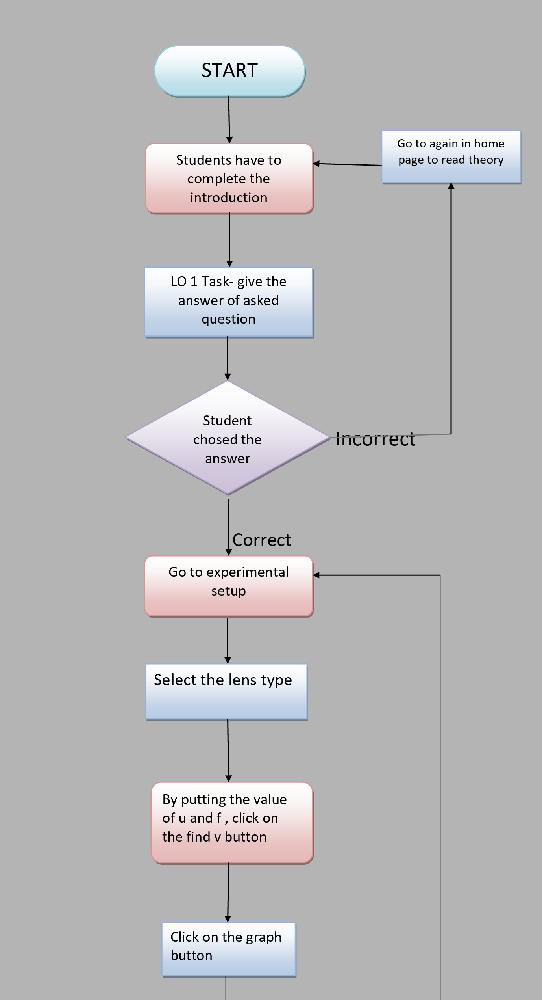

# Storyboard (Round 2)

## 1.	Story Outline: 
When any ray of light incident on lens ,it reflects the light. The position, nature and size of the image of an object formed by a convex lens depends on the position of the object with respect to optical nature .It can be also study by using cartesian sign and drawing the corresponding ray diagrams.
The image formation by convex lens and concave lens is shown in diagrams. The graph between u and v is also represented .

## 2. Story:  

### 2.1 Set the Visual Stage Description:

**1** . By putting the value of u and f, you will get the actual position of the image.

**2** . Value of v will be calculated. 

**3** . In this experiment, images are also shown that tells the nature of image (real and virtual.

**4** .	See the slope of the graph.

## 2.2 Set User Objectives & Goals:
**1**. To recall and complete the experiment to find out the nature of image using convex and concave lens. 
**2**. Follow step by step procedure to complete the Experiment.
**3**. To study how to plot the graph between u(distance of object) and v(distance of image).
**4**. To see the constant slope of the graph.
**5**. To observe  the graph between u-v and to observe the image position.

## 2.3 Set the Pathway Activities:

##### Student will follow the the following steps:

**1**.	When you will open the site ,first of all you have to read the theory of experiment and give the answer of a question.

**2**.	Then ,you will be able to perform the experiment. So click on the lens type and put the value of u and f.

**3**.	You will get the distance of image.

**4**.	Values of u and v will be calculated.

**5**.	On the basis of u and v ,t he graph will be shown.

## 2.4 Set Challenges and Questions/Complexity/Variations in Questions:

**1**. Student will be asked questions based on various cognitive levels. List of questions provided in Round 1 document.

**2**. Student will be asked to solve questions based on experiment.  

## 2.5 Allow pitfalls: 

**1**. When you put the value of u and f, it will take the values according to the lenses.

**2**. The focal length of a convex lens is positive ,then it does not allow to take the focal length in negative it automatically converts it in positive. 

**3**. The focal length of a concave lens is negative, then it will not Take the values in positive it will automatically converts in negative.

**4**. As object distance is always positive ,so it will never take the value of u eith positive convention.

## 2.6 Conclusion:
**(i)**. WE GET IMAGE DISTANCE. 

**(ii)**.WE KNOW THE NATURE OF IMAGE.

**(iii)**.WE CAN SEE Graph of lens.

## 2.7 Equations/formulas:
When the student will enter the value of u(distance of object) and f(focal length), corresponding value of v(distance of image) will be calculated according to the formula:
                                   
**(1/v)-(1/u)=1/f**
  
**(1/v)=(1/f)+(1/u)**
	
**(1/v)=(u+f)/(u*f)**
	
 **v=(u*f)/(u+f)**

## 3. Flowchart :

## 4. Mindmap

## 5. Story board

## 6. Some particular images
